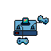

# Thunderbird Arcade System Emulator



## Running locally

1. `git clone` this repository

2. Install dependencies. Do one of the following
```
pnpn i
npm i
yarn add
```

3. Starting the dev server

`(p)npm run dev`

## Building

`(p)npm run build`

The app is built to the `dist` folder.

## Deploying

The `dist` folder can be deployed to static host providers (Netlify, Github Pages, ...).
